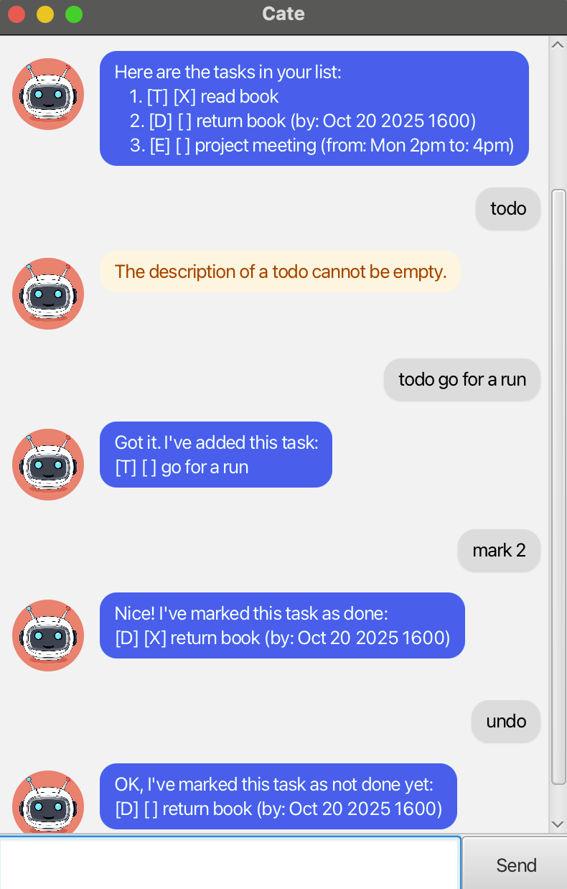

# Cate User Guide



Cate is a personal task manager designed to help you manage your tasks efficiently. You can add todos, deadlines, and events, list tasks, find tasks by keyword, and mark/unmark tasks as done. Cate also supports undoing previous commands for convenience.

---

### Adding Todos

Use the todo command to add a simple task without a due date.

**Format:** `todo DESCRIPTION`

Example:
```
todo Read book
```

Adds a task called “Read book” to your list.

### Adding Deadlines

Use the deadline command to add a task with a specific due data and time.

**Format:** `deadline DESCRIPTION /by YYYY-MM-DD HHMM`

Example:
```
deadline Submit report /by 2025-09-20 2359
```

Adds a new task called “Submit report” that is due on 20th September 2025 at 23:59.

### Adding Events

Use the event command to add a task that occurs between a start and end time.

**Format:** `event DESCRIPTION /from START /to END`

Example:
```
event Team meeting /from Mon 10:00 /to 11:00
```

Adds a task called “Team meeting” scheduled from Mon 10:00 to 11:00.

### Listing Tasks

Use the list command to display all tasks in your list.

**Format:** `list`

Example:
```
list
```

Displays all tasks along with their type, completion status, and relevant details.

```text
1.[T][ ] Read book
2.[D][ ] Submit report (by: Sep 20 2025, 23:59)
3.[E][ ] Team meeting (from: Mon 10:00 to 11:00)
```

### Marking and Unmarking Tasks

Mark a task as done using mark INDEX and mark it as not done using unmark INDEX.

**Format:** `mark INDEX`
**Format:** `unmark INDEX`

Example:
```
mark 2
unmark 2
```

Updates the completion status of the task at index 2.

```text
Marked as done:
[D][X] Submit report (by: Sep 20 2025, 23:59)

Marked as not done:
[D][ ] Submit report (by: Sep 20 2025, 23:59)
```

### Finding Tasks

Use the find command to search for tasks containing a specific keyword.

**Format:** `find KEYWORD`

Example:
```
find report
```

Lists tasks whose descriptions contain the word “report”.

```text
1.[D][ ] Submit report (by: Sep 20 2025, 23:59)
```

### Deleting Tasks

Use the delete command to remove a task by its index.

**Format:** `delete INDEX`

Example:
```
delete 1
```

### Undoing Commands

Use the undo command to reverse the last executed command that supports undo.

**Format:** `undo`

Example:
```
undo
```

### Exiting Cate

**Format:** `bye`

Use the bye command to close the application.